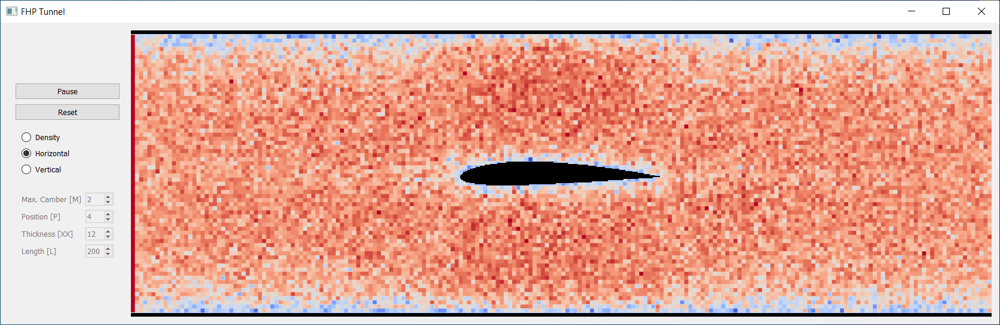

# FHP Tunnel

> **HINWEIS:**
> Dieser zelluläre Automat zur fluiddynamischen Simulation der Umströmung von NACA-Profilen 
> wurde im Rahmen einer Vorlesung erstellt.

> **NOTE:**
> This cellular automaton for fluid dynamic simulation of the flow around NACA profiles 
> was created in the context of a lecture.

This small application was coded initially as part of a student project.
It is a Lattice gas automaton with a hexagonal grid (model introduced by Uriel **F**risch, Brosl **H**asslacher and Yves **P**omeau in 1986),
simulating a flow around a NACA-Profile in a tunnel. Further enhancements are going to be done soon!
